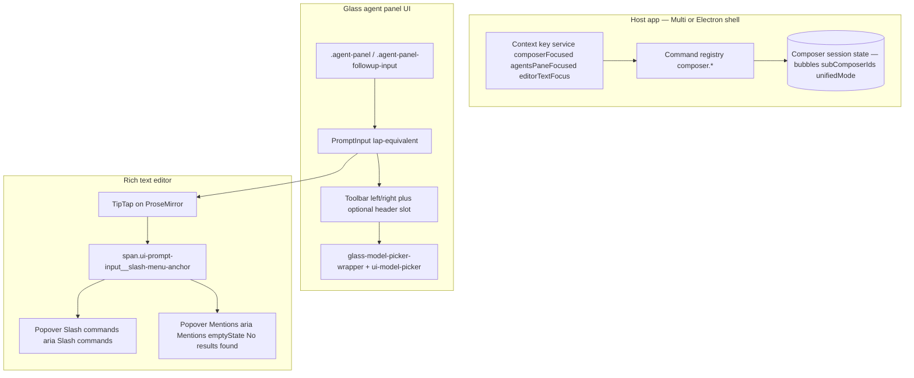

# Cursor Glass composer — re-implementation blueprint (bundle-harvested)

## Source artefacts (local Cursor.app)

| Asset                                                                                                                                                                                        | ~Size  | Role                                                                                                                                                                                         |
| -------------------------------------------------------------------------------------------------------------------------------------------------------------------------------------------- | ------ | -------------------------------------------------------------------------------------------------------------------------------------------------------------------------------------------- |
| [`/Applications/Cursor.app/Contents/Resources/app/out/vs/workbench/workbench.desktop.main.js`](/Applications/Cursor.app/Contents/Resources/app/out/vs/workbench/workbench.desktop.main.js)   | ~51 MB | Minified workbench; original paths appear in `Le({"out-build/vs/workbench/..."})` loaders. Composer lives under `contrib/composer/browser/` (constants, services, Solid-style `K`/`It` JSX). |
| [`/Applications/Cursor.app/Contents/Resources/app/out/vs/workbench/workbench.desktop.main.css`](/Applications/Cursor.app/Contents/Resources/app/out/vs/workbench/workbench.desktop.main.css) | ~2 MB  | Mostly **one minified line**; composer/Glass rules are **substring-searchable**, not sectioned by file layout.                                                                               |

**Limitation:** Closed product; hashes and minified identifiers change between releases. Treat this as a **behavioral + DOM/CSS contract spec**, not a copy-paste source drop.

---

## Target architecture for a clean-room re-implementation



Implement **narrow vertical slice first**: `PromptInput` + TipTap + dual popovers + CSS variables — then bolt **composer session** and **keybinding parity** onto your host (`packages/app`-style SPA or Electron).

---

## Phase 1 — Glass / agent panel shell (CSS contracts)

Implement wrappers and modifiers that match selectors found in CSS (search offsets for these strings):

- **`body[data-cursor-glass-mode=true]`** — global Glass layout gate (composer human message overrides, strokes, etc.).
- **`.agent-panel`** — outer region.
- **`.agent-panel-followup-input`** — wraps follow-up composer; variants:
  - **`--disabled`**: disables pointer events on inner `.ui-prompt-input`; forces `cursor: default` on editor chrome.
  - **`--conversation-overlay`**: ties to **`glass-composer-usage-status-bar-mount`** (max-height, opacity transitions); hides usage bar when **`[data-scrolled-to-bottom]`** absent on container.
- **`.agent-prompt-input-root`** — flex host for **`glass-model-picker-wrapper`** and compact/expansion choreography on **`ui-prompt-input__container[data-variant=compact]`** (`data-expanded`, **`data-compact-visible`** reordering).

**Re-implementation checklist:** padding adjustments when usage bar mounts (`:has(.glass-composer-usage-status-bar-mount>*>*)`), z-index layering for **`agent-panel-followup-status-area`** vs **`glass-chat-status-bar`**.

---

## Phase 2 — `PromptInput` wrapper component (`Iap` contract)

Minified **`Iap`** is the owning component for **`ui-prompt-input`**. Re-implement under your own name; preserve **props + DOM**:

### Props (preserve names or map 1:1 in adapter)

| Prop                                                                                   | Default / notes                                                                                                 |
| -------------------------------------------------------------------------------------- | --------------------------------------------------------------------------------------------------------------- |
| **`variant`**                                                                          | `"expanded"` — drives compact layout (`data-variant` on root + container).                                      |
| **`headerContent`**, **`headerContentVisible`**                                        | Optional row **above** field; rendered as **`div.ui-prompt-input__header`** with **`data-visible`**.            |
| **`footerContent`**                                                                    | **`div.ui-prompt-input__footer`**.                                                                              |
| **`onSubmit`**, **`submitOnCmdEnter`**                                                 | Submit policy (Cmd/Ctrl+Enter gate in context).                                                                 |
| **`isRunning`**, **`onStop`**, **`onEscape`**                                          | Generation / stop lifecycle.                                                                                    |
| **`isDragging`**, drag handlers (`onDragOver`, `onDragEnter`, `onDragLeave`, `onDrop`) | File / image drag; counter ref for nested enter/leave (`qe.current` pattern).                                   |
| **`onImageDrop`**, **`hasImages`**                                                     | Filter `dataTransfer.files` to `type.startsWith("image/")` then delegate.                                       |
| **`slashMenuPlacement`**, **`plusMenuPlacement`**, **`modelPickerPlacement`**          | Popover anchoring; defaults derived from variant (e.g. compact + not expanded → model picker **`bottom-end`**). |
| **`slashMenuItemPrefix`**                                                              | `"/"` default; **cleared to `""`** when **`slashMenuVariant === "glass"`** (item display prefix only).          |
| **`slashMenuVariant`**                                                                 | `"default"` \| `"glass"` (affects prefix + styling hook).                                                       |
| **`slashMenuAnchor`**                                                                  | `"cursor"` (default) vs **`"input-start"`** — changes fixed positioning of anchor vs coords from selection.     |
| **`showMentionSidePreview`**, plugins, ignore-click resolver                           | Optional side preview for mentions.                                                                             |
| **`className`**, **`children`**                                                        | `children` = main editor subtree injected **inside** container **before** anchor span.                          |

### Root DOM shape (must match for CSS)

```html
<div class="ui-prompt-input" data-variant="…">
  <div class="ui-prompt-input__header" data-visible="true|false">…</div>
  <!-- if headerContent -->
  <div
    class="ui-prompt-input__container"
    data-variant="…"
    data-expanded?
    data-dragging?
    data-menu-direction="up"
    ?
  >
    …children (editor)…
    <span class="ui-prompt-input__slash-menu-anchor"></span>
  </div>
  <!-- popovers portaled; see Phase 4 -->
  <div class="ui-prompt-input__footer">…</div>
</div>
```

### Internal state buckets (mirror behavior)

- **Slash menu:** `isOpen`, `query`, `position`, `selectedIndex`, `expandedSections` (Set), `sections` (list), `schedule` reposition on editor `update` / `selectionUpdate` + `ResizeObserver` on view DOM.
- **Mentions menu:** parallel state + **`isLoading`** for async items + **`Qt` debounce counter** for action-type selection (increment on action select, decrement on close).
- **`isExpanded` / `needsExpansion` / `hasContent` / `hasImages` / `menuForceExpanded`:** compose whether compact UI should expand (defaults: variant expanded → always expanded).

### React context (`YDr.Provider` equivalent)

Expose a **single context object** (`Sr`) consumed by toolbar / editor children. Minimum fields harvested:

`variant`, `editor` (TipTap instance), `setEditor`, `hasContent`, `setHasContent`, `isRunning`, `onSubmit`, `submitOnCmdEnter`, `onStop`, `onEscape`, `getSubmitData`, `setGetSubmitData`, `isFocused`, `setIsFocused`, `needsExpansion`, `setNeedsExpansion`, `isExpanded`, `slashMenu` (state bundle), `mentionMenu` (state bundle), `slashMenuVariant`, `containerRef`, `setMenuOpen` / `isMenuOpen`, `menuForceExpanded`, `setMenuForceExpanded`, `onImageDrop`, `menuPlacement` (plus menu default), `defaultModelPickerPlacement`, `mentionItemsLoading`, `setMentionItemsLoading`.

### Imperative handle (`ne` ref)

Register methods: **`focus()`** (`editor.commands.focus("end")`), **`blur()`**, **`clear()`** (clear content + reset flags), **`getText()`** (block separator newline), **`getCommands()`** → `i6u(editor)`, **`getMentions()`** → `c6u(editor)`, **`getSubmitData()`**, expose **`editor`**.

---

## Phase 3 — TipTap document schema and extensions

### JSON document shape

Persist and load a **TipTap/ProseMirror JSON doc** with root **`{ type: "doc", content: [...] }`**. Unknown string → try `JSON.parse`; reject if not `type === "doc"`.

### Node kinds (readonly renderer `uUu`)

| `type`                            | Rendering                                                                                                                                                                                                     |
| --------------------------------- | ------------------------------------------------------------------------------------------------------------------------------------------------------------------------------------------------------------- |
| **`doc`**                         | Fragment                                                                                                                                                                                                      |
| **`paragraph`**                   | `<p>`                                                                                                                                                                                                         |
| **`text`**                        | Text with optional marks → bold/italic/strike/code/link (`ui-prompt-input-link`, safe URL http/https only)                                                                                                    |
| **`hardBreak`**                   | `<br>`                                                                                                                                                                                                        |
| **`mention`** / **`mentionNode`** | **`Lap`** → pill **`ui-pill ui-prompt-input-mention-chip`** (`data-type="mentionNode"`, `data-read-only-mention`) + leading icon (**Cursor icon component** vs **Seti** file icon) + optional line range span |
| **`commandNode`**                 | **`Nap`** → **`ui-prompt-input-command-chip`**; interactive **`button.ui-prompt-input-command-chip__label--clickable`** showing `/${name}`                                                                    |

### Base extensions bundle (`dUu`)

Approximate Cursor’s stripped configuration:

1. **StarterKit-like group** with **disabled**: `heading`, `link` (replaced), `bulletList`, `orderedList`, `blockquote`, `codeBlock`, `horizontalRule`.
2. **Custom Link extension** — `openOnClick: false`, `enableClickSelection: false`, `linkOnPaste: false`, `autolink: false`, `defaultProtocol: "https"`, `isAllowedUri` only `http`/`https`, `HTMLAttributes.class: "ui-prompt-input-link"`.
3. **`commandNode` extension** (`GPr`) — `HTMLAttributes.class: "ui-prompt-input-command-chip"`.
4. **Mention extension** (`VPr`) — `HTMLAttributes.class: "ui-pill ui-prompt-input-mention-chip"`, suggestion config: plugin key, **`char: "@"`**, **`allowSpaces: true`**, `allowedPrefixes: null`, default **`allow: () => false`** + empty `items` until host wires async provider, `render` lifecycle hooks `onStart`/`onUpdate`/`onExit`.

### Editor surface

- Editable: class **`ui-prompt-input-editor__input`**, `editorProps.attributes.tabindex = "-1"` (focus managed deliberately).
- Read-only mirror: **`ui-prompt-input-tiptap-readonly`** + same content class for parity.

### Slash / command insertion

On accept: **delete trigger range**, **`insertCommand({ id, name, content, type })`**, insert trailing space, **`chain().focus().run()`** pattern (see `xft` helper region in bundle).

---

## Phase 4 — Slash and @ popovers (`Xkr`)

Two instances of the same popover component with different `aria-label` and plumbing:

| Popover  | `aria-label`       | `itemPrefix`                       | `onItemSelect` behavior                                                                    |
| -------- | ------------------ | ---------------------------------- | ------------------------------------------------------------------------------------------ |
| Slash    | `"Slash commands"` | `""` when glass variant else `"/"` | `onSelect` then close + clear query                                                        |
| Mentions | `"Mentions"`       | `""`                               | If `type==="action"` bump debounce counter; always `onSelect`; non-action closes sub-state |

Shared: **`placement`** from `slashMenuPlacement ?? "top-start"`; **`anchorRef`** = anchor span; **`sections`**, **`selectedIndex`**, **`expandedSections`**, **`isSearching`** (slash uses normalized query helper `vPt(wt)`), mentions pass **`isLoading`**, **`emptyStateText: "No results found"`**, optional **`mentionSidePreview`**.

**Anchor positioning logic:** If `slashMenuAnchor === "input-start"`, pin anchor to `left:0` and clear top/bottom; else use **`coordsAtPos`** from ProseMirror for cursor or stored `position` index; subtract container `getBoundingClientRect()`; vertical = top vs bottom based on whether `placement` starts with `"top"`.

---

## Phase 5 — Unified mode UI + model picker (visual parity)

### `Kdf` mode → CSS variable map (replicate in your theme layer)

| Mode key         | Maps to                                                                                              |
| ---------------- | ---------------------------------------------------------------------------------------------------- |
| **`agent`**      | transparent bg, `var(--vscode-input-foreground)` text, `var(--vscode-button-background)` icon button |
| **`chat`**       | `--composer-mode-chat-background/text`                                                               |
| **`background`** | `--composer-mode-background-background/text`                                                         |
| **`plan`**       | plan bg/text/icon/border quad                                                                        |
| **`triage`**     | triage tokens with fallbacks to input/focus borders                                                  |
| **`spec`**       | spec quad                                                                                            |
| **`debug`**      | debug quad                                                                                           |

**Dropdown attr skin:** `.composer-unified-dropdown[data-mode=chat|background|plan|spec|debug]` forces `!important` background/foreground overrides in bundle CSS — mirror with your design tokens.

### Model picker

- Wrapper: **`.glass-model-picker-wrapper`** with **`--agent-prompt-model-picker-max-width`** (240px default; 200px when compact not expanded + `data-compact-visible`).
- Trigger: **`.ui-model-picker__trigger`**, **`.ui-model-picker__trigger-text`** (truncate overflow).
- Icon: **`.glass-model-picker-inline-icon-brain`** (`--icon-size: 11px`, slight translateY).

### Toolbar layout CSS (also duplicated inline in JS string)

- **`role="toolbar"`** `.ui-prompt-input-toolbar` — flex space-between, padding `var(--prompt-input-toolbar-padding)`, gap 8px.
- **`[data-variant=compact]`** → `display: contents` on toolbar until `[data-expanded]` restores flex.
- **`__left`**: `flex: 1 1 0; min-width: 0; container-type: inline-size; gap: 4px`.
- **`[data-variant=compact]:not([data-expanded]) .ui-prompt-input-toolbar__left > *:not([data-compact-visible]) { display: none }`** — explicit visibility contract for “top icon row”.

---

## Phase 6 — Keyboard and context-key parity

### Tab / Shift+Tab vs SubComposer vs Chat selection

| Command id                              | Title (bundle)                  | `primary` | Weight | `when`                                                         |
| --------------------------------------- | ------------------------------- | --------- | ------ | -------------------------------------------------------------- |
| `composer.selectPreviousComposer`       | Select Previous Chat            | 2575      | 410    | `(composerFocused \|\| agentsPaneFocused) && !editorTextFocus` |
| `composer.selectPreviousSubComposerTab` | Select Previous SubComposer Tab | 2575      | 200    | `composerFocused`                                              |
| `composer.selectNextComposer`           | Select Next Chat                | 2577      | 410    | same as first row                                              |
| `composer.selectNextSubComposerTab`     | Select Next SubComposer Tab     | 2577      | 200    | `composerFocused`                                              |

**Net effect:** While the **prompt editor** holds `editorTextFocus`, the **higher-weight chat navigation** is suppressed → **SubComposer tab** commands handle **Tab / Shift+Tab** (same numeric chord, lower weight). When focus is on **non-editor composer chrome**, **Previous/Next Chat** wins.

**Re-implementation:** implement an equivalent **dispatcher** or align with VS Code `KeybindingResolver` semantics (when clauses + weights). Map numeric primaries → physical keys via the same bitmask rules as Electron/VS Code, or bypass numbers and bind **Shift+Tab**/**Tab** directly in your SPA with the above branch.

### Separate tab commands (`fuc` / `guc`)

Constants also define **`composer.previousChatTab`** and **`composer.nextChatTab`** alongside **`composer.selectSubComposerTab1`…`8`** and **`composer.selectSubComposerTabLast`** — distinguish **workspace-level composer tabs** vs **sub-composer** strip; wire according to product needs.

### TipTap Tab consumption

When **slash/@ menu closed**, optional **`shouldConsumeTabForIndent`**: plain **Tab** indent **only if** predicate true and **`visibleItemCount === 0`**; **`Shift+Tab`** **does not** trigger indent consumption (`shiftKey` short-circuits).

### Glass keyboard allowlists (FYI)

Bundle includes string lists **`Mgm`** / **`Ngm`** merged into **`Bgm`** (`composer.focusComposer` sits beside `glass.*` tab helpers) — relevant if embedding a Chromium **before-input** interceptor for Glass.

---

## Appendix A — Composer command IDs found in bundle (parity / telemetry naming)

Alphabetized **`composer.*`** strings (85) anchored near `contrib/composer/browser/constants.js`:

- `composer.acceptComposerStep`
- `composer.acceptPendingFromNotification`
- `composer.addfilestocomposer`
- `composer.addfilestonewcomposer`
- `composer.addsymbolstocomposer`
- `composer.addsymbolstonewcomposer`
- `composer.approvePendingShellToolDecision`
- `composer.approvePendingShellToolDecisionAllowlist`
- `composer.cancelChat`
- `composer.cancelComposerStep`
- `composer.cancelComposerStepInputFocused`
- `composer.cancelTerminalToolCall`
- `composer.clearComposerTabs`
- `composer.closeComposerTab`
- `composer.closeOtherComposerTabs`
- `composer.copyRequestId`
- `composer.copyRequestIdFromEditor`
- `composer.copyRequestIdFromPane`
- `composer.createNewComposerTab`
- `composer.createNewWithPrevContext`
- `composer.cycleMode`
- `composer.cycleModel`
- `composer.cycleModelParameter`
- `composer.duplicateChat`
- `composer.exportChatAsMd`
- `composer.find.focus`
- `composer.find.hide`
- `composer.find.next`
- `composer.find.previous`
- `composer.fixerrormessage`
- `composer.focusComposer`
- `composer.forkSharedChat`
- `composer.getComposerHandleById`
- `composer.getOrderedSelectedComposerIds`
- `composer.handleBugBotDeeplink`
- `composer.handleBugBotMultipleDeeplinks`
- `composer.newAgentChat`
- `composer.nextChatTab`
- `composer.openAddContextMenu`
- `composer.openAsBar`
- `composer.openAsPane`
- `composer.openChatAsEditor`
- `composer.openComposer`
- `composer.openComposerFromNotification`
- `composer.openInWebForBackgroundComposer`
- `composer.openModeMenu`
- `composer.openModelToggle`
- `composer.openTerminalInWorktree`
- `composer.openVMForBackgroundComposer`
- `composer.previousChatTab`
- `composer.rejectPendingFromNotification`
- `composer.renameChat`
- `composer.reportFeedback`
- `composer.resetMode`
- `composer.resolveAllConflictsInChat`
- `composer.resumeCurrentChat`
- `composer.selectNextComposer`
- `composer.selectNextSubComposerTab`
- `composer.selectPreviousComposer`
- `composer.selectPreviousSubComposerTab`
- `composer.selectSubComposerTab1`
- `composer.selectSubComposerTab2`
- `composer.selectSubComposerTab3`
- `composer.selectSubComposerTab4`
- `composer.selectSubComposerTab5`
- `composer.selectSubComposerTab6`
- `composer.selectSubComposerTab7`
- `composer.selectSubComposerTab8`
- `composer.selectSubComposerTabLast`
- `composer.sendToAgent`
- `composer.shareChat`
- `composer.showBackgroundAgentHistory`
- `composer.showComposerHistory`
- `composer.showComposerHistoryEditor`
- `composer.showViewMenu`
- `composer.skipPendingShellToolDecision`
- `composer.startComposerPrompt`
- `composer.startComposerPrompt2`
- `composer.startComposerPromptFromSelection`
- `composer.testNotification`
- `composer.toggleChatAsEditor`
- `composer.toggleVoiceDictation`
- `composer.triggerCreateWorktreeButton`
- `composer.updateStatus`
- `composer.updateTitle`

**Related `workbench.action.backgroundComposer.*`:** `createNewComposerTab`, `createNewComposerWithPrevContext`, `showBackgroundAgentHistory`.

---

## Appendix B — CSS / JS search methodology (keep while Cursor updates)

1. **JS:** `python` byte scan for `function Iap({` … / `contrib/composer/browser/constants.js` / `commandNode`.
2. **CSS:** regex `[\w\-]*composer[\w\-]*` over bytes; for each unique token, expand ±200 chars.
3. **Inline styles:** `ui-prompt-input-toolbar` appears both in **CSS file** and **embedded string** inside **JS** — diff by searching bundle for `.ui-prompt-input-toolbar {`.

---

## Appendix C — Original 10-way parallel harvest map (still valid)

1. `constants.js` — command IDs + mode constants.
2. Keybinding classes — all `composer.*` `{primary,weight,when}`.
3. `Iap` tree + `YDr` context fields.
4. TipTap schema + `dUu` extension list.
5. SubComposer / background / worktree UI (`background-composer-*`, `subComposerIds`).
6. `isGlass` / `data-cursor-glass-mode` branches.
7. Model config + picker data flow.
8. Telemetry strings (`composer.*` event names).
9. `Kdf` ↔ `--composer-mode-*` crosswalk.
10. CSS offset index + JS-inlined style duplicates.
