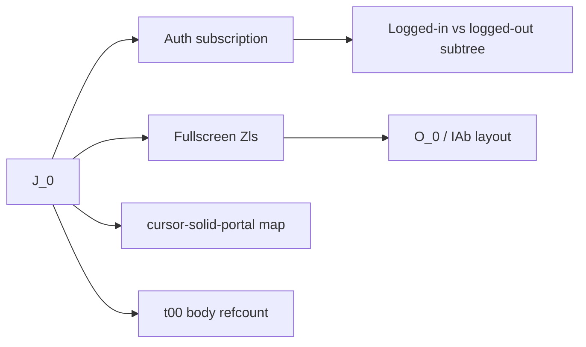

# Cursor Glass: window state, threads, sidebar (bundled behavior)

## User focus (explicit)

This document **de‑emphasizes composer internals** (message streaming, protobuf request bodies). It focuses on:

1. How the **Glass window / shell** holds and derives UI state (`J_0`, fullscreen, portals, auxiliary windows).
2. How **moving between threads/agents** is represented (services + reactive updates, especially popouts).
3. How **sidebar width and collapse** work (DOM attributes, CSS variables, persisted schema fields, workbench unified sidebar).

## Scope and limitation

- Primary source: [`/Applications/Cursor.app/Contents/Resources/app/out/vs/workbench/workbench.desktop.main.js`](/Applications/Cursor.app/Contents/Resources/app/out/vs/workbench/workbench.desktop.main.js) (~51MB minified). Names are obfuscated; behavior is inferred from literals and control flow.
- CSS for Glass sidebar also appears as **string CSS inside the JS bundle** (not only `workbench.desktop.main.css`).

## 1) Window-level state (Glass root `J_0`)

`J_0` is the top of the Glass React tree. From the extracted implementation:

- **Fullscreen**: uses **`Zls()`** (window fullscreen) and passes **`isWindowFullScreen`** into layout wrappers (`IAb` / `O_0`), affecting how the shell positions children.
- **Auth shell**: subscription to login service updates local refs and **`useState`**; toggles between **`$_0`** (authenticated layout with error boundary, splash opacity flag, alert stack size) and **`fy0`** (logged-out).
- **Portals / solid layer**: effect creates a **`cursor-solid-portal`** node, registered in a **`Window` → element** map (`cge`) so overlays can render outside the main flex column.
- **Body glass mode** (see §4): applied when the Glass root is mounted via **`t00(document.body)`** refcount—window-level presentation hook for CSS variables and scoped rules.

## 2) Thread / agent transitions (not “composer state” alone)

Switching **which agent/thread is active** is driven by **services and reactive entries**, not only React local state:

- **Active composer resolution** (from dev-only command text in bundle): `glassActiveAgentService.getActiveAgentId()` → `agentRepositoryService.getAgent` → `composerDataHandle.composerId`, with fallbacks to empty draft and `composerDataService.selectedComposerId`.
- **Popout / auxiliary window handoff**: **`retargetChatPopout(oldAgentId, newAgentId)`** re-keys an internal **`_entries` map**, updates **`i.agentIdReactive.set(t)`**, focuses the auxiliary window, and may dispose the old entry—this is an explicit **ID migration** path when the same window should follow a new agent.
- **Reactive agent list**: earlier UI code shows effects that close a popout when an agent id **disappears** from the agents collection—thread list and popout state stay **consistent** via reactions, not a one-off navigation call.
- **Server config**: **`glass_tiling_config`** includes **`showDraftsInSidebar`** (product-level behavior when switching or listing threads vs drafts).

For Multi or other clients, the lesson is: **model “current thread” as a service-selected id + derived handles**, and treat **popout windows** as **separate `Window` state** that must be **retargeted** when agent ids change.

## 3) Sidebar width and collapse state

### 3a) Glass `ui-sidebar` (React/CSS)

The bundle embeds rules and component props for:

- **CSS variables**: `--sidebar-width`, `--sidebar-width-collapsed`, optional **`--sidebar-min-width`** / **`--sidebar-max-width`** passed as inline style when numbers are provided.
- **Attributes**: **`data-state=collapsed`**, **`data-resizing=true`**, **`data-side=left|right`**.
- **Resize**: **`ui-sidebar-resize-handle`** with **`onMouseDown`**; collapsed state uses **`var(--_sidebar-width-collapsed)`** (default **48px** in the embedded snippet), expanded uses **`var(--_sidebar-width)`** (default **180px** in snippet).

So **width state** is **both** inline/theme variables **and** discrete **collapsed vs expanded** `data-state`.

### 3b) Persisted numeric widths (workbench / layout schema)

A **zod-like schema** in the bundle defines persisted fields (defaults in parentheses), including:

- **`fileTreeSidebarWidth`**: number **min 180, max 460, default 220** (+ `fileTreeSidebarExpanded`).
- **`diffTreeSidebarWidth`**: same bounds, default 220 (+ `diffTreeSidebarExpanded`).
- **`terminalTreeWidth`**: same pattern (+ `terminalTreeExpanded`).
- **`canvasSidebarExpanded`**: boolean.

These are **durable layout dimensions** separate from one-off React render state.

### 3c) Workbench “unified” / overlay sidebar (VS Code integration)

Minified helpers appear for **unified sidebar** behavior, e.g.:

- **`_storeUnifiedSidebarWidth`**, **`_getEffectiveDockedSidebarWidth`**, **`_usesTemporaryOverlaySidebarState`**, **`_overlaySidebarVisible`**, **`_setUnifiedSidebarLocationImpl`**, **`agent_sidebar_position`**, **`GlassSidebar`**, **`ToggleUnifiedSidebar`**.

Interpretation: Cursor **merges classic VS Code sidebar concepts** with **Glass-specific** placement; width may be **docked vs overlay** with **temporary overlay** behavior on exit.

## 4) Mount path (context only—body glass refcount)

`n00` bootstraps the Glass React root: **`t00(body)`** sets **`data-cursor-glass-mode`** + refcount, **`createRoot(container).render(J_0)`**, disposes unmount + **`glassThemeService.refreshBodyStyles()`**. This is **window/document presentation**, not thread content.

## 5) Out of scope for this iteration

- Composer message streaming, **`GetComposerChatRequest`** fields, tool cards.
- Full DI token map (`fx`, `aA`, …) unless needed to debug §2–§3.

## Relation to Multi

[`packages/app`](packages/app) can mirror **patterns**: persist sidebar widths in app storage, keep **active thread id** in a single store/service, and if you add **popout/auxiliary** windows, plan an explicit **retarget** when thread ids change.

## Suggested follow-up

- Break on **`retargetChatPopout`** and **`_storeUnifiedSidebarWidth`** in DevTools to capture call stacks with readable service names.
- Diff two Cursor versions if **`glass_tiling_config`** or sidebar schema defaults change.
