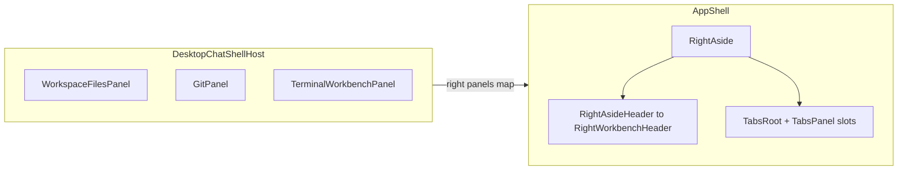

# Right sidebar (workbench column) — deep dive and plan

## What “right sidebar” actually is

In this repo it is **`RightAside`** in [`packages/app/src/components/shell/shell/app.tsx`](packages/app/src/components/shell/shell/app.tsx): a fixed column to the **right** of the main chat surface (`agent-window__agent-panel`), only rendered when `AppShell` receives a non-null `right` slot map (`showRight`). On **web**, [`ChatShellHost`](packages/app/src/components/shell-host.tsx) passes `right={null}`; on **Electron**, [`DesktopChatShellHost`](packages/app/src/components/shell-host.tsx) injects **`files`**, **`git`**, and **`terminal`** panels. So depth work on behavior and UX is inherently **desktop-first today**.

## Layers (outside → inside)

| Layer                    | Role                                                                                                                                                                           | Primary files                                                                                                                                                                                                                                                                                                                                                  |
| ------------------------ | ------------------------------------------------------------------------------------------------------------------------------------------------------------------------------ | -------------------------------------------------------------------------------------------------------------------------------------------------------------------------------------------------------------------------------------------------------------------------------------------------------------------------------------------------------------- |
| **Shell column**         | Width `0–600px`, `transition-[width]`, sash on the **left** edge (`multi-shell-sash-hit-area--align-start`), `data-agent-window-workbench=""`                                  | [`app.tsx`](packages/app/src/components/shell/shell/app.tsx), [`shell.css`](packages/app/src/styles/shell.css) `.agent-window__workbench`, sash rules                                                                                                                                                                                                          |
| **Workbench tabs**       | `TabsRoot` + three `TabsPanel` children with **`keepMounted`** and absolute stacking (`workbenchPanelSlotVariants`: inactive panels `pointer-events-none invisible opacity-0`) | [`app.tsx`](packages/app/src/components/shell/shell/app.tsx) `RightAsidePanels`                                                                                                                                                                                                                                                                                |
| **Header / tool island** | Git/Terminal/Files icon tabs (`TabsTab`), terminal session pills + New, spacer; compact **panel tab row** (`editor-panel-tab-root`, `multi-workbench-tool-island`)             | [`right-workbench-header.tsx`](packages/app/src/components/shell/shell/right-workbench-header.tsx), [`workbench-chrome-row.tsx`](packages/app/src/components/shell/shell/workbench-chrome-row.tsx), [`shell.css`](packages/app/src/styles/shell.css)                                                                                                           |
| **Per-tool body**        | Each panel optionally wraps content in **`RightWorkbenchLayout`** (secondary rail + main) with **its own** right-edge sash (`--align-end`)                                     | [`right-workbench-layout.tsx`](packages/app/src/components/shell/shell/right-workbench-layout.tsx); used by [`workspace-files-panel.tsx`](packages/app/src/components/shell/files/workspace-files-panel.tsx), [`terminal` stack in shell-host](packages/app/src/components/shell-host.tsx), [`git/panel.tsx`](packages/app/src/components/shell/git/panel.tsx) |

## State, routing, and “why did it open?”

- **Persisted UI state** lives in [`shell-panels-store.ts`](packages/app/src/lib/shell-panels-store.ts): per-`cwd` keys for `rightOpen`, `rightW`, `activeTab`, `muted`, secondary rail open/width, terminal sessions list.
- **Effective visibility** uses `resolveEffectiveRightOpen()` in [`app.tsx`](packages/app/src/components/shell/shell/app.tsx): the panel is treated as **open** if stored `rightOpen` **or** `(routeThreadId && gitFocusId && !muted)`. That ties the right rail to git review focus without dumping the invariant in every consumer.
- **Electron-only URL sync**: `search.workbench` from `/_chat` is applied so `activeTab` matches navigation (see effects in `RightAside`).
- **Title bar affordances**: [`ElectronHeaderControls`](packages/app/src/components/shell/shell/app.tsx) shrinks the drag region by `rightWidth` when open so traffic-light / draggable chrome stays coherent.
- **`--multi-shell-right-workbench-width`** is set on the root shell div when `showRight` for layout/CSS that keys off measured width ([`AppShell`](packages/app/src/components/shell/shell/app.tsx)).

Useful mental model: **outer column** resize vs **inner secondary rail** resize are independent; both use nearly the same pointer-RAF pattern copied between left aside, right aside, and `RightWorkbenchLayout`.

## Styling Alignment

Canonical look is anchored in [**`shell.css`**](packages/app/src/styles/shell.css):

- **`agent-window__workbench`**: panel tint from Multi workbench tokens.
- **`.multi-workbench-tool-island.editor-panel-tab-root`**: explicit “avoid heavy blur” matte strip (backdrop-filter none).
- **Borders**: `::before` / `::after` hairlines + secondary rail `::after`.

Token plumbing for sash hit targets sits in [**`tokens.css`**](packages/app/src/styles/tokens.css) (`--multi-shell-sash-hit-width`, hover shade mix).

Prior left rail work established the benchmarking workflow; extending it to the **right** bundle means comparing `.editor-panel*` / panel-tab references against these sections rather than rewriting React first.

---

## Recommended work streams (pick order by goal)

### 1) Document and harden behavior (low risk)

- Add a short **inline module comment** atop `RightAside` (or adjacent `readme` in codebase standards you already use) listing: Electron-only mounting, `keepMounted` implication (all three tabs’ trees stay alive—important for terminals and large file trees), and the `muted`/`gitFocusId` visibility rule.
- Add **focused tests** around `resolveEffectiveRightOpen`, URL↔tab sync, and mute toggling (`setRightPanelOpen` tying `muted` ↔ `rightOpen`). Today this logic is concentrated in [`app.tsx`](packages/app/src/components/shell/shell/app.tsx); tests would lock regressions during refactors.

### 2) Product: web vs desktop parity (forking decision)

- If browsers should expose Files/Git/Terminal, **`ChatShellHost`** must pass the same `right` map when environment features allow it, and the **floating** [`RightPanelChromeToggle`](packages/app/src/components/shell/shell/app.tsx) path (non-Electron positioning) becomes the primary discoverability UX.
- If desktop-only is intentional, explicitly **surface that in UX copy or docs** so web users are not chasing missing controls.

### 3) Architecture: dedupe sash resize logic (maintainability)

- Extract a small **`useColumnResize`** (or pure handlers + `ResizeState`) shared by **`LeftAside`**, **`RightAside`**, and **`RightWorkbenchLayout`**, preserving current limits (`RIGHT_LIMITS`, `SECONDARY_RAIL_LIMITS`, left limits from store). Keeps RAF + pointer capture identical and reduces divergence bugs.

### 4) UX / fidelity pass

- **Workbench header**: unify focus rings with project Tailwind v4 preference (`outline-hidden` vs scattered `outline-none` in [`right-workbench-header.tsx`](packages/app/src/components/shell/shell/right-workbench-header.tsx)), terminal session tabs vs `TabsTab` patterns (consistent `aria-*` for “tab strip”).
- **Hit targets**: verify sash `--align-start`/`--align-end` feel symmetric across RTL and high-DPI (optional tweak to `--multi-shell-sash-hit-width` per feedback).
- **Performance**: reconsider **`keepMounted`** for heavy tabs—if terminals must stay mounted, document why; otherwise explore lazy mounting with explicit session restore semantics.

---

## Verification after changes

- **`cd packages/app && vite build`** — validates Tailwind + `@import` layering for `tokens.css` / `shell.css` edits.
- **`bun lint`** (includes [`lint:css` / Stylelint on `packages/**/*.css`](package.json)).
- Smoke on **Electron** for: resize outer column, resize secondary rails (files tree, terminal rail), toggle right panel mute, Git focus forcing open behavior.
