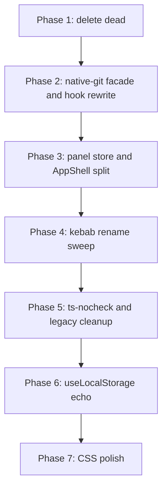

## Canonical rules (this whole plan serves these)

- **Filenames: kebab-case** for everything except the two carve-outs below. Example: `use-environment-git.ts`, `chat-view.tsx`, `shell-panels-store.ts`.
- **Effect Services / Layers carve-out**: anything under `.../Services/*.ts` or `.../Layers/*.ts` stays PascalCase. Examples: `apps/server/src/auth/Services/AuthControlPlane.ts`, `apps/server/src/git/Layers/GitManager.ts`.
- **Namespace / class module carve-out**: files that export an Effect-style namespace or a class meant to be imported as a module stay PascalCase. Examples: `packages/shared/src/Struct.ts`, `packages/shared/src/Net.ts`, `packages/shared/src/String.ts`, `packages/shared/src/DrainableWorker.ts`, `apps/server/src/observability/Metrics.ts`, `apps/server/src/git/Utils.ts`, `apps/server/src/git/Prompts.ts`.
- **React component exports stay PascalCase.** Only the filename changes.
- **No `@ts-nocheck`.** Type-fix the file.
- **No compat shims** (e.g., `native-api.ts` re-exporting `localApi`).
- **No migration code for legacy names** (`glass:`, `@t3tools`, legacy localStorage keys). Nothing to migrate - the repo is unreleased.
- **No dead code parked for later.** Delete.

## Problem surface

### Two parallel git paths

Live (rooted in [apps/web/src/components/shell-host.tsx](apps/web/src/components/shell-host.tsx)):

- `components/shell-host.tsx` owns `useShellPanels(activeCwd)` at line 115. Every toggle re-renders the whole `ShellHost` → `AppShell` → `<Outlet />` → `RoutedChatSession` → `ChatMessages` (1021 lines) → `ChatComposer` chain.
- `hooks/use-environment-git.ts` mixes three mechanisms: local `useState`/`useRef`/`seq` for status (lines 176-251), `useQueries` for patches (lines 330-359), raw `getWsRpcClientForEnvironment(env).git.runStackedAction` for commit/push/branch (lines 387-424). `snap=null` conflates loading, error, and not-yet-started, which is the "Git error flicker" at mount / reconnect.

Dead (from dpcode upstream, not imported):

- `components/Sidebar.tsx` (3012 lines default export)
- `components/GitActionsControl.tsx` + `.logic.*`
- `components/BranchToolbar*.tsx`
- These still import atom-based `useGitStatus` (the good flow) and `gitReactQuery` for branches - we keep those libs, just delete the dead consumers.

### Duplicate hooks

Both exist today, actively used (Grep'd):

- `useTheme.ts` (dpcode) + `use-theme.ts` (shell) - content diverges: camelCase has `syncBrowserChromeTheme` + theme-color meta tag; kebab has `applyColorPalette` + `glass:theme` legacy migration.
- `useLocalStorage.ts` + `use-local-storage.ts` - both have the self-echo loop.
- `useMediaQuery.ts` + `use-media-query.ts`.
- `useCopyToClipboard.ts` + `use-copy-to-clipboard.ts`.

Live consumers of camelCase (Grep output, abbreviated): `ChatView.tsx`, `DiffPanel.tsx`, `DiffWorkerPoolProvider.tsx`, `ChatMarkdown.tsx`, `SettingsPanels.tsx`, `routes/_chat.$environmentId.$threadId.tsx`, `ui/sidebar.tsx`, `ui/toast.tsx`, `chat/MessageCopyButton.tsx`, `chat/ProposedPlanCard.tsx`, `settings/ConnectionsSettings.tsx`, `editorPreferences.ts`, `clientPersistenceStorage.ts`, `composerDraftStore.ts`. Not dead - they just import the wrong twin.

### 35 `@ts-nocheck` files

All under `apps/web/src`, many inside the shell reimpl (see Grep output from research). Most will typecheck cleanly after the git / panel rewrite; a handful need real type fixes.

### Legacy migration code

- `use-theme.ts` reads `glass:theme` and migrates to `multi:theme`.
- `uiStateStore.ts` has 10 legacy persisted-state keys (`codething:renderer-state:v1..v4`, `multi:renderer-state:v3..v8`).
- `use-local-storage.ts` previously used `glass:local_storage_change` event name (already renamed to `multi:local_storage_change`).

None of this is needed in an unreleased build.

## Fix

### Phase 1 - Delete dead paths

Before renaming anything, remove dead files so we do not carry duplicates through the kebab rename.

| File                                                                                                        | Action                                                                                                                                                                                    |
| ----------------------------------------------------------------------------------------------------------- | ----------------------------------------------------------------------------------------------------------------------------------------------------------------------------------------- |
| [apps/web/src/components/Sidebar.tsx](apps/web/src/components/Sidebar.tsx)                                  | Delete default export. Move `Sidebar.logic.ts` contents into `lib/thread-sidebar.ts` and repoint the 3 live importers (`_chat.tsx`, `use-handle-new-thread.ts`, `use-thread-actions.ts`). |
| [apps/web/src/components/GitActionsControl.tsx](apps/web/src/components/GitActionsControl.tsx) + `.logic.*` | Delete (not imported).                                                                                                                                                                    |
| [apps/web/src/components/BranchToolbar\*.tsx](apps/web/src/components/BranchToolbar.tsx)                    | Delete (not imported).                                                                                                                                                                    |
| [apps/web/src/components/shell/shell/chat.tsx](apps/web/src/components/shell/shell/chat.tsx)                | Delete (duplicate shell copy, never mounted).                                                                                                                                             |
| [apps/web/src/components/shell/settings/shell.tsx](apps/web/src/components/shell/settings/shell.tsx)        | Delete (duplicate shell copy, never mounted).                                                                                                                                             |
| [apps/web/src/hooks/use-shell-panels.ts](apps/web/src/hooks/use-shell-panels.ts)                            | Delete after Phase 3 lands.                                                                                                                                                               |
| [apps/web/src/native-api.ts](apps/web/src/native-api.ts)                                                    | Delete - fold into `lib/native-runtime-api.ts` and repoint ~6 importers.                                                                                                                  |

### Phase 2 - Unify git flow through one `NativeGitApi` facade

Full surface for every git interaction the UI needs, living only in [apps/web/src/lib/native-git-api.ts](apps/web/src/lib/native-git-api.ts):

```ts
export interface NativeGitApi {
  refreshStatus: (input: { cwd: string }) => Promise<GitStatusResult>;
  onStatus: (
    input: { cwd: string },
    cb: (s: GitStatusResult) => void,
    opts?: { onResubscribe?: () => void },
  ) => () => void;
  init: (input: { cwd: string }) => Promise<void>;
  discardPaths: (input: { cwd: string; paths: string[] }) => Promise<void>;
  getFilePatch: (input: { cwd: string; path: string }) => Promise<{ unifiedDiff: string }>;
  runStackedAction: (input: {
    cwd: string;
    action: "commit" | "commit_push" | "push";
    commitMessage?: string;
    featureBranch?: boolean;
  }) => Promise<void>;
  listBranches: (input: {
    cwd: string;
    query?: string;
    pageParam?: number;
  }) => Promise<GitBranchPage>;
  checkout: (input: { cwd: string; branch: string }) => Promise<void>;
  pull: (input: { cwd: string }) => Promise<void>;
  preparePullRequestThread: (input: { cwd: string; threadId: ThreadId }) => Promise<void>;
}
```

Rewrite [apps/web/src/hooks/use-environment-git.ts](apps/web/src/hooks/use-environment-git.ts) as:

```ts
export function useEnvironmentGitPanel(environmentId: EnvironmentId | null): GitPanelModel {
  const { cwd } = useShellState();
  const status = useGitStatus({ environmentId, cwd });
  const view = deriveGitPanelViewState(status, cwd); // discriminated union
  const [expandedIds, setExpandedIds] = useState<Set<string>>(() => new Set());
  const patches = useQueries({
    queries: [...expandedIds].map((path) =>
      gitPatchQueryOptions({ environmentId, cwd, path, enabled: Boolean(cwd) }),
    ),
  });
  const actions = useGitActions(environmentId, cwd);
  return { view, expandedIds, ...bindExpanded(setExpandedIds), ...patches, ...actions };
}
```

`useGitStatus` from [apps/web/src/lib/gitStatusState.ts](apps/web/src/lib/gitStatusState.ts) already does ref-counted subscribe + pending state + reconnect + debounced refresh. Drop all of it from the hook.

GitPanel renders from the discriminated `view.kind`:

```ts
switch (view.kind) {
  case "idle":
  case "loading": return <Skeleton />;
  case "error": return <GitError message={view.error} />;
  case "no-repo": return <NoRepo onInit={actions.init} />;
  case "clean": return <CleanTree />;
  case "changed": return <GitPanelInner view={view} {...actions} />;
}
```

That kills the "Git error flicker" at the source.

### Phase 3 - Panel state moves off `ShellHost`

- [apps/web/src/lib/shell-panels-store.ts](apps/web/src/lib/shell-panels-store.ts) - zustand, keyed by cwd, persists to localStorage directly. Selector hooks return primitives so each consumer only re-renders when its slice changes.
- [apps/web/src/components/shell/shell/app.tsx](apps/web/src/components/shell/shell/app.tsx) splits into `AppShell` (structural, no state) + `LeftAside(cwd)` + `RightAside(cwd, changesCount)` + `ElectronHeaderControls(cwd, onBack?)`. Drag logic lives inside the owning aside.
- [apps/web/src/components/shell-host.tsx](apps/web/src/components/shell-host.tsx) passes `cwd={activeCwd}`. Stops calling `useShellPanels`. Does not re-render on toggle.

Result: toggles commit only the relevant aside. The chat tree stays put. `react-grab`'s fiber walker has a quiet tree and stops freezing.

### Phase 4 - Kebab canonicalization (subagent-parallelizable)

Rule applied in every batch: file is kebab unless the file is in `Services/` or `Layers/`, OR it is a namespace/class module (see Canonical rules).

Six subagent batches run in parallel after Phases 1-3 land:

- **4A apps/web/src/hooks** - merge the 4 duplicate pairs into kebab, rename 4 camelCase singletons, rewrite imports repo-wide.
- **4B apps/web/src/components** - rename ~60 PascalCase files + their `.logic.ts` / `.logic.test.ts` / `.browser.tsx` / `.test.ts` siblings. Component exports unchanged.
- **4C apps/web/src root + lib + rpc** - rename camelCase utils (composerDraftStore, composerHandleContext, threadDerivation, threadSelectionStore, clientPersistenceStorage, gitReactQuery, gitStatusState, desktopUpdateReactQuery, requestLatencyState, wsConnectionState, wsTransport, wsRpcClient, transportError, atomRegistry).
- **4D apps/desktop/src** - rename clientPersistence, syncShellEnvironment, updateMachine, updateState, backendPort, appBranding, runtimeArch, serverListeningDetector, serverExposure, backendReadiness, desktopSettings, confirmDialog and their tests.
- **4E apps/server/src** - rename serverRuntimeStartup, serverRuntimeState, imageMime, cliAuthFormat, git/githubPullRequests, git/remoteRefs. KEEP PascalCase: `**/Services/*.ts`, `**/Layers/*.ts`, and namespace modules `git/Prompts.ts`, `git/Utils.ts`, `observability/{Metrics,Attributes,TraceSink,TraceRecord,LocalFileTracer,RpcInstrumentation}.ts`.
- **4F packages/** - rename `contracts/src/{providerRuntime,baseSchemas}.ts`, `client-runtime/src/knownEnvironment.ts`, `shared/src/{cliArgs,projectScripts,qrCode,searchRanking,schemaJson,serverSettings}.ts`. KEEP PascalCase namespace/class modules `shared/src/{Struct,Net,String,DrainableWorker,KeyedCoalescingWorker}.ts`.

Each subagent: rename with `git mv`, run `bun --filter <workspace> typecheck`, rewrite imports until green, commit at batch boundary.

### Phase 5 - `@ts-nocheck` and legacy migration cleanup

- Remove all 35 `@ts-nocheck` directives and fix types for real. Most of the flagged files are in the shell reimpl that just got simplified by Phase 2 & 3, so most should go cleanly with minor annotation work.
- Delete `glass:theme` fallback, `LEGACY_PERSISTED_STATE_KEYS`, `legacyKeysCleanedUp` flag, any `@t3tools` remnants outside historical changelogs.

### Phase 6 - `useLocalStorage` self-echo

In the surviving [apps/web/src/hooks/use-local-storage.ts](apps/web/src/hooks/use-local-storage.ts):

```ts
const originRef = useRef<string>(nextLocalStorageOriginId());
queueMicrotask(() => dispatchLocalStorageChange(key, originRef.current));

const handleLocalChange = (e) => {
  if (e.detail.key === key && e.detail.origin !== originRef.current) syncFromStorage();
};
```

Cross-component sync preserved. Every LS-backed write costs one commit instead of two.

### Phase 7 - CSS polish

In [apps/web/src/components/shell/shell/app.tsx](apps/web/src/components/shell/shell/app.tsx) (renamed to `app-shell.tsx`):

- Include `border-right-width` / `border-left-width` in the aside transition lists so borders do not pop at endpoints.
- Add `transition-opacity duration-150 ease-out motion-reduce:transition-none` + `opacity-100` / `opacity-0` on the left aside inner, matching the right.

## Execution order and parallelism

Serialized dependencies:



Phase 4 fans out to six subagents (4A-4F) that run in parallel. Each subagent owns a disjoint directory scope and reconciles imports via Grep, so they do not stomp on each other.

## Verification gate between phases

After each phase, all of these must pass:

- `bun --filter @multi/web typecheck`
- `bun --filter @multi/server typecheck`
- `bun --filter @multi/desktop typecheck`
- `bun --filter @multi/web test`
- `bun --filter @multi/server test`
- Grep canaries:
  - `rg "@ts-nocheck" apps packages` → 0 after Phase 5
  - `rg "glass:" apps packages` → 0 after Phase 5
  - `rg "@t3tools" apps packages` → 0 after Phase 5
  - `rg "getWsRpcClientForEnvironment.*\\.git\\." apps/web/src/components apps/web/src/hooks` → 0 after Phase 2
  - `rg -l '^use[A-Z]' apps/web/src/hooks packages/*/src` → 0 after Phase 4
  - `rg -l "native-api\.ts|use-shell-panels\.ts" apps packages` → 0 after Phase 4

## Acceptance behavior

- React Profiler on a sidebar toggle: only the animating aside commits. `ShellHost`, `Outlet`, `RoutedChatSession`, `ChatMessages`, `ChatComposer`, `GitPanel` stay quiet.
- React Profiler on a git status tick: only `GitPanel` (and open `GitFileCard`s) commit.
- `GitPanel` does not render a red error on initial mount or reconnect unless status actually errored.
- With `react-grab` loaded, toggling sidebar and hovering over the app does not freeze.
- Every source file in `apps/` and `packages/` matches the canonical naming rules.
