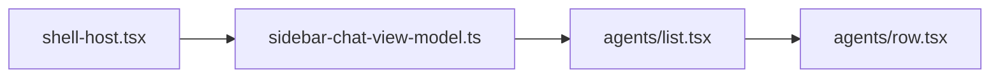

# Sidebar list indicators: Cursor reference vs Multi codebase

## Reference model (Cursor app bundle)

Cursor’s Glass sidebar uses a **priority stack** (`e6S` in minified workbench JS): migrating loader, archived icon, PR glyph, in-progress spinner when `source !== "draft"`, optional sparse placeholder, then **`X5S(status, source, hasUnread)`** driving **`agent-status-dot--{draft|running|needs-attention|done-unseen|done-seen}`**. Plan mode and most uses of the word **“stale”** in that bundle are **not** this dot API (composer suggestions, caches, observables, protobuf `is_stale`, etc.).

## Where Multi implements the same product surface

| Concern                                         | Location                                                                                                                                                                                                                                                                                                                                                                                                                                                                                                                                                                                        |
| ----------------------------------------------- | ----------------------------------------------------------------------------------------------------------------------------------------------------------------------------------------------------------------------------------------------------------------------------------------------------------------------------------------------------------------------------------------------------------------------------------------------------------------------------------------------------------------------------------------------------------------------------------------------- |
| Merge threads + drafts, `SidebarChatItem` shape | [`packages/app/src/lib/sidebar-chat-view-model.ts`](/Users/workgyver/Developer/multi/packages/app/src/lib/sidebar-chat-view-model.ts) — `buildThreadChat`, `buildDraftChat`, `buildWorkspaceChatSections`                                                                                                                                                                                                                                                                                                                                                                                       |
| `isStreaming` → sidebar “running”               | [`packages/app/src/components/shell-host.tsx`](/Users/workgyver/Developer/multi/packages/app/src/components/shell-host.tsx) — `toSummary` maps `orchestrationStatus` to `SessionListSummary.isStreaming` (explore agent); feeds summaries into `buildWorkspaceChatSections`                                                                                                                                                                                                                                                                                                                     |
| Row UI + leading indicator                      | [`packages/app/src/components/shell/agents/row.tsx`](/Users/workgyver/Developer/multi/packages/app/src/components/shell/agents/row.tsx) — `StatusDot`, `StatusSlot`                                                                                                                                                                                                                                                                                                                                                                                                                             |
| List container / skeleton loading               | [`packages/app/src/components/shell/agents/list.tsx`](/Users/workgyver/Developer/multi/packages/app/src/components/shell/agents/list.tsx) — `agent-sidebar-list`, `SkeletonRows`                                                                                                                                                                                                                                                                                                                                                                                                                |
| Unread IDs                                      | [`packages/app/src/lib/thread-unread-store.ts`](/Users/workgyver/Developer/multi/packages/app/src/lib/thread-unread-store.ts); wired from [`shell-host.tsx`](/Users/workgyver/Developer/multi/packages/app/src/components/shell-host.tsx) (clear on select; row context menu `mark`)                                                                                                                                                                                                                                                                                                            |
| In-timeline “working” (not sidebar)             | [`packages/app/src/components/chat/messages-timeline.tsx`](/Users/workgyver/Developer/multi/packages/app/src/components/chat/messages-timeline.tsx), [`messages-timeline.logic.ts`](/Users/workgyver/Developer/multi/packages/app/src/components/chat/messages-timeline.logic.ts), [`working-status-row.tsx`](/Users/workgyver/Developer/multi/packages/app/src/components/chat/working-status-row.tsx), [`thinking-indicator.tsx`](/Users/workgyver/Developer/multi/packages/app/src/components/chat/thinking-indicator.tsx)                                                                   |
| Cursor-style bubbles / tool chrome              | [`packages/app/src/components/chat/cursor-chat-bundle.tsx`](/Users/workgyver/Developer/multi/packages/app/src/components/chat/cursor-chat-bundle.tsx) — `CursorMessageBubble`, `CursorThinkingStatus`, `CursorToolCallRenderer`; consumed by [`human-message.tsx`](/Users/workgyver/Developer/multi/packages/app/src/components/chat/human-message.tsx), [`assistant-message.tsx`](/Users/workgyver/Developer/multi/packages/app/src/components/chat/assistant-message.tsx), [`tool-call-message.tsx`](/Users/workgyver/Developer/multi/packages/app/src/components/chat/tool-call-message.tsx) |
| Sidebar-related CSS                             | [`packages/app/src/styles/shell.css`](/Users/workgyver/Developer/multi/packages/app/src/styles/shell.css) — e.g. `.agent-sidebar-cell-status`, `.agent-sidebar-list`; tokens comment in [`tokens.css`](/Users/workgyver/Developer/multi/packages/app/src/styles/tokens.css) references workbench list styling                                                                                                                                                                                                                                                                                   |

### Exact indicator logic today (sidebar)

[`row.tsx`](/Users/workgyver/Developer/multi/packages/app/src/components/shell/agents/row.tsx) `StatusDot`:

- Draft row: `IconFormCircle`
- `state === "running"`: ping + emerald dot
- `state === "error"`: destructive dot _(type allows it; see gap below)_
- Thread + `unread`: `IconBell`
- Default idle: muted small dot

[`sidebar-chat-view-model.ts`](/Users/workgyver/Developer/multi/packages/app/src/lib/sidebar-chat-view-model.ts) `buildThreadChat`:

- `state: sum.isStreaming ? "running" : "idle"` — **`error` is never set here**

## Gap analysis vs Cursor dot semantics

- **Unread / done**: Cursor uses **`done-unseen` vs `done-seen`** dots (+ subdued styling). Multi uses a **bell icon** for unread instead of an accent dot; idle threads use one muted dot.
- **Needs attention**: Cursor has **`needs-attention`** (warning-colored dot). Multi has no equivalent unless you map an orchestration/tool failure signal into sidebar state.
- **Draft vs running**: Cursor separates **`source === "draft"`** (hollow dot) from **`in_progress`** (spinner when not draft). Multi: draft rows use form icon; running uses emerald ping — broadly similar intent, different visuals.
- **PR / archived / migrating / sparse placeholder**: Not implemented on Multi sidebar rows today.
- **`error` state**: Declared on [`SidebarChatItem`](/Users/workgyver/Developer/multi/packages/app/src/lib/sidebar-chat-view-model.ts) but **unused** in `buildThreadChat`; `StatusDot` branch is dormant unless another caller sets `state`.

## Suggested implementation phases (only if you want parity)

1. **Single source of truth for sidebar status** — Extend [`buildThreadChat`](/Users/workgyver/Developer/multi/packages/app/src/lib/sidebar-chat-view-model.ts) (or `SessionListSummary` / orchestration projection) to derive `idle | running | error | needs_attention` (names aligned with your domain events). Optionally mirror Cursor’s `done-seen` / `done-unseen` by folding `unread` into dot styling instead of `IconBell`.
2. **Visual parity (optional)** — Add CSS variables / pseudo-element dots akin to Cursor’s `--glass-sidebar-agent-status-dot-size` and modifier classes, or reuse [`@multi/ui/status-dot`](/Users/workgyver/Developer/multi/packages/ui) if appropriate (already referenced in [`settings-panels.tsx`](/Users/workgyver/Developer/multi/packages/app/src/components/settings/settings-panels.tsx)).
3. **Tests** — Extend [`chat-view.browser.tsx`](/Users/workgyver/Developer/multi/packages/app/src/components/chat-view.browser.tsx) or unit tests for [`thread-sidebar`](/Users/workgyver/Developer/multi/packages/app/src/lib/thread-sidebar.ts) / row snapshots if you change indicator rules.

## Scope decision

If the goal is **documentation only**, stop after the map above. If the goal is **UI parity with Cursor**, prioritize (a) unread-as-dot vs bell, (b) wiring **`needs_attention`** / **`error`** from orchestration, then (c) optional PR/archived/migrating behaviors.

## Implementation note

Multi now derives sidebar status through `SessionListSummary.orchestrationStatus` and `needsAttention`, then maps `idle | running | error | needs_attention` in `buildThreadChat`. The row leading indicator uses the shared `@multi/ui/status-dot` states for `draft`, `running`, `critical`, `needsAttention`, `doneUnseen`, and `doneSeen`, so unread is dot semantics instead of a bell glyph.

The project-section plus path now passes the clicked section cwd through `ShellHost.create(cwd)`, resolves the concrete project, and calls `startNewThreadInProjectFromContext`. That action uses `resolveSidebarNewThreadSeedContext` for project-local branch/worktree seeding and sets `reuseExistingDraft: false`, so clicking a project plus opens a fresh empty composer for that project instead of reusing an existing draft. Empty draft shells are filtered out of sidebar sections until the composer has visible draft content (prompt text or attachments).
